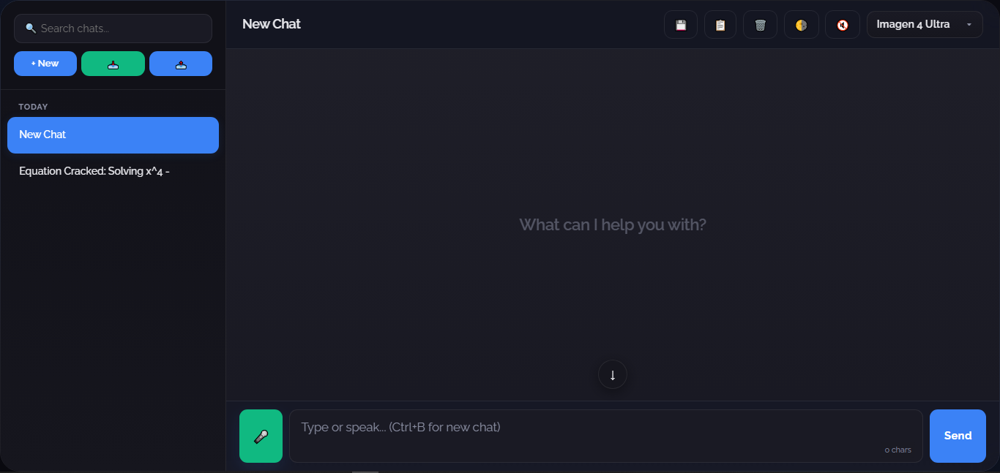
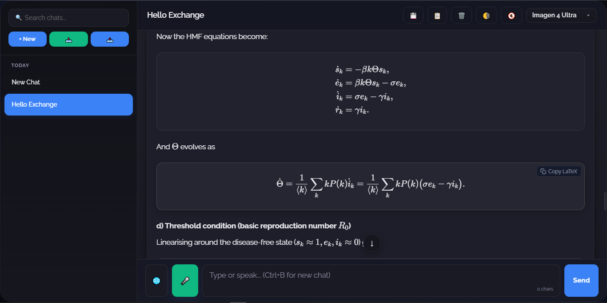

<div align="center">


<br/>

[]()
[](https://spectrix-ai.vercel.app)
[](https://spectrix-ai.vercel.app)
[](https://spectrix-ai.vercel.app)
[](https://spectrix-ai.vercel.app)
[](https://spectrix-ai.vercel.app)
[](https://spectrix-ai.vercel.app)
[](https://spectrix-ai.vercel.app)
[](https://spectrix-ai.vercel.app)

<br/>


</div>

---

## 🌐 Live Demo

| Link | Description |
|------|-------------|
| 🚀 [spectrix-ai.vercel.app](https://spectrix-ai.vercel.app) | Primary deployment |

> ⚡ Local-first by default. Sign in with Google to unlock cloud backup + real-time multi-device sync.

---

## 📝 Documentation Promise

- README is updated with every shipped feature and major behavior change.
- Vercel and Cloudflare variants stay documented in parity.

---

## 🔥 What is Spectrix AI?

**Spectrix AI** is a high-performance, PWA-first AI chatbot engineered for students, developers, and power users.

Built from scratch — **zero frameworks, zero bloat** — it combines:
- 🤖 Multi-model AI routing via **OpenRouter** (GPT-OSS 120B, MiniMax M2.5, Nemotron 3 Super)
- ⚡ Serverless backend on **Vercel Functions** with smart key rotation + route rewrites
- 🧮 **Full LaTeX math rendering** via KaTeX + MathJax with copy-to-clipboard
- 📡 **Offline-first** architecture with IndexedDB local persistence
- 🎤 **Voice I/O** — speak to it, hear it speak back
- 🧠 **Persistent AI Memory** — remembers you automatically, across sessions
- 🌐 **Web search mode** — real-time answers via Firecrawl + OpenRouter
- 🖼️ **Image + Video generation** — `/img` and `/vid` commands
- 🔒 **Incognito mode** — zero trace, zero persistence, zero cloud
- ☁️ **Firebase Auth + Firestore** — Google Sign-In, profile management, cloud chat backup

> **Short version:** *it cooks. consistently. 🔥*

---

## 📊 By The Numbers

| Stat | Value |
|------|-------|
| 🗓️ Build Duration | 3+ months |
| 🔁 Commits | 530+ |
| 🚀 Deployments | 280+ |
| 📦 Framework | None (Vanilla JS) |
| ⚙️ Backend | Vercel Functions |
| 📱 Architecture | Single-file PWA (`index.html`) |

> Iteration cycle: `build → test → deploy → refine → repeat`

---

## ⚡ Core Features

### 🤖 AI Engine
- **Real-time SSE streaming** via `/chat/stream` — no waiting for full output
- **Legacy simulated streamer kept commented** in `index.html` as a fallback reference
- **Multi-model routing** via OpenRouter — switch models from the header
- **Smart API key rotation** — maximizes uptime and handles rate limits gracefully
- **Rate-limit UX** — friendly in-app message, not a dead crash
- **Web search mode** — powered by Firecrawl via OpenRouter (`Ctrl+Shift+S` to toggle)
- **Auto-titled chats** — AI names your conversations after the first exchange
- **Title model pinned** — `openai/gpt-oss-120b:free`
- **Direct-answer guardrails** — avoids made-up headings like "Quick Concept" / "Game Plan" unless requested
- **Retry + Edit** — re-run any response or tweak your message mid-conversation

### 🧠 AI Memory
- **Persistent memory** across conversations — the AI knows who you are
- **Auto-extraction** — silently learns your name, preferences, goals, and tech stack
- **Memory extraction model pinned** — `nvidia/nemotron-3-super-120b-a12b:free`
- **Manual memory** — add facts yourself via the 🧠 panel
- **Categorized** — personal, preference, technical, interest, context, general
- **Full control** — view all memories, delete individually, or wipe clean
- **Toggle on/off** — disable auto-learning anytime
- **Cooldown-throttled** — extraction runs max once every 5 minutes, no spam
- **Deduplication** — near-identical facts are never saved twice
- **Local-first IndexedDB** — fast on-device memory persistence
- **Firestore memory sync** — auto-mirrors memories across signed-in devices

### 🎤 Voice & Interaction
- **Voice input** via Web Speech API — tap 🎤, speak, done
- **Text-to-Speech output** — AI responses read aloud via the 🔊 toggle
- **`+` quick-actions menu** — opens Attach files/photos, Voice input, and Web search actions in one place
- **TTS audio unlock** — mobile-compatible auto-unlock on first user interaction
- **Voice confirmation** — audible "Voice enabled" on toggle so you know it works
- **Keyboard shortcuts:**
  - `Ctrl+B` / `Cmd+B` → New chat
  - `Ctrl+F` / `Cmd+F` → Search messages in chat
  - `Ctrl+Shift+S` → Toggle web search
  - `Ctrl+/` → Focus history search

### 🧮 Math & Code
- **KaTeX + MathJax dual-engine** — renders inline `$...$`, display `$$...$$`, and complex environments
- **Auto-rescue** — bare LaTeX commands wrapped in delimiters automatically
- **Copy LaTeX button** — hover any math block to copy the raw TeX
- **Code blocks** — syntax highlighting via Highlight.js, copy button, collapse toggle
- **Markdown** — full support: tables, blockquotes, headings, bold, italic, lists, images

### 📎 Multi-file Context
- **Multi-file attachments** in chat input (up to 8 files)
- **Text extraction** from plain/code files, PDF, and DOCX
- **Image OCR extraction** via Tesseract.js (client-side, lazy-loaded)
- **Safe truncation caps** for per-file and total extracted context

### 🖼️ Media Generation
- `/img <prompt>` — generates images using your selected model:
  - Imagen 4 Ultra / Fast
  - Nano Banana (Gemini Image)
  - FLUX.2 Max
  - GPT Image 1.5
- `/vid <prompt>` — generates short looping videos via ByteDance Seedance
- **Saved locally** — generated media persisted in IndexedDB as Blobs

### 📱 App Experience
- **Installable PWA** — install on mobile or desktop like a native app
- **Offline-ready** — service worker caches the app shell
- **iOS install hint** — smart banner on Safari/iOS guides install
- **Auto-update** — new service worker activates without user action
- **Single-file architecture** — monolithic `index.html`, no build step
- **Dark/light theme** — toggle anytime, persists to `localStorage`
- **Incognito mode** — full blackout: no IndexedDB writes, no cloud sync, no memory, no profile persistence
- **Chat pinning** — pin important conversations to the top
- **Chat search** — fuzzy search across all history titles + message content
- **In-chat message search** — highlight matching messages with `Ctrl+F`
- **Export/Import** — download chats as `.md` or `.json`, re-import anytime
- **No browser popups** — clean custom modals for all alerts, confirms, and prompts
- **Custom select dropdowns** — animated, keyboard-navigable, beautiful
- **Composer alignment polish** — textarea, `+`, `Send`, and `Stop` stay visually aligned with balanced control sizing across desktop and mobile

### ☁️ Google Auth + Cloud Sync
- **Google Sign-In** via Firebase Auth (popup with redirect fallback)
- **Real-time Firestore sync** — chats and memories auto-mirror create/update/delete when logged in
- **Fallback timer sync** — polls cloud every 30s if realtime listener is blocked
- **Tombstone system** — deleted chats stay deleted across devices, no resurrection
- **Profile control hub** — backup, edit name/photo, upload device picture, or sign out
- **Profile injected into memory** — name remembered by the AI automatically
- **Ad-blocker resilience** — falls back gracefully when Firestore is blocked by extensions

---

## 🧠 AI Memory — How It Works

```
User sends message
    │
    ├── AI responds normally
    │
    └── Background: Memory Extraction (throttled, async)
          │
          ├── Analyzes conversation for memorable user facts
          ├── Deduplicates against existing memories (80% word-overlap check)
          ├── Categorizes: personal / preference / technical / interest / context
          └── Saves to IndexedDB → 'memories' store (local-first)
                │
                ├── If signed in + not incognito:
                │     Mirrors to Firestore users/{uid}/memories
                │     and listens for real-time updates from other devices
                │
                └── Every future conversation
                      │
                      └── Top 30 memories injected into system prompt
                            → AI uses context naturally, without repeating it back
```

> 🔒 Memories are **local-first** in IndexedDB and sync to Firestore only when signed in (disabled in incognito).

---

## 🧠 AI Models

| Mode | Model | Best For |
|------|-------|----------|
| ⚡ Quick | `openai/gpt-oss-120b:free` | Fast chats, tools, and agent loops |
| 🚀 Smart | `minimax/minimax-m2.5:free` | Coding and productivity workflows |
| 🧠 Reasoning | `nvidia/nemotron-3-super-120b-a12b:free` | Deep reasoning and long-context tasks |

> 💾 Model preference saved to `localStorage → Spectrix_text_model` and persists across sessions.

---

## 🏗️ Architecture

```
User Browser
    │
    ├── PWA (Single HTML file — HTML/CSS/Vanilla JS)
    │     ├── IndexedDB ['chats']    → Chat history (primary source of truth)
    │     ├── IndexedDB ['memories'] → AI Memory (persistent user context)
    │     ├── IndexedDB ['media']    → Generated image/video blobs
    │     ├── Service Worker         → Offline caching + auto-update
    │     ├── Web Speech API         → Voice input + TTS output
    │     ├── KaTeX + MathJax        → Dual-engine math rendering
    │     ├── Firebase Auth          → Google Sign-In
    |     ├── Image/Video model endpoints → Puter.js
      │     └── Firebase Firestore     → Cloud chat + memory backup + real-time sync
    │
    └── Vercel Functions (`/api/*` + rewrites)
          ├── `/chat`           → OpenRouter JSON completion
          ├── `/chat/stream`    → OpenRouter real SSE relay
          ├── `/github`         → GitHub Models completion
          ├── `/hf/img`         → Hugging Face image generation
          ├── `/hf/vid`         → Hugging Face video generation
          ├── `/leaderboard/top`    → leaderboard read
          └── `/leaderboard/submit` → leaderboard update

```

---

## 🚀 Quick Start

```bash
# Option 1 — npx serve
npx serve .

# Option 2 — Python
python -m http.server 5500

# Option 3 — VS Code Live Server
# Right-click index.html → Open with Live Server

# Option 4 — Vercel local runtime (API routes + rewrites)
npx vercel dev
```

Then open:
```
http://127.0.0.1:5500
```

> Frontend still has no build step. Vercel deployment uses serverless API routes + environment variables.

---

## ▲ Vercel Deployment

### Required environment variables

- `WORKER_OPENROUTER_KEY`
- `WORKER_OPENROUTER_KEY_2` (optional)
- `WORKER_OPENROUTER_KEY_3` (optional)
- `GITHUB_MODELS_KEY`
- `HUGGINGFACE_KEY`

### Optional (persistent leaderboard on Vercel KV)

- `KV_REST_API_URL`
- `KV_REST_API_TOKEN`

If KV is not set, leaderboard falls back to in-memory storage in the running function instance.

---

## 💻 Tech Stack

| Layer | Tech |
|-------|------|
| Frontend | HTML, CSS, Vanilla JavaScript |
| Local Storage | IndexedDB (chats + memories + media) |
| Cloud Sync | Firebase Firestore (chats + memories) |
| Auth | Firebase Auth (Google Sign-In) |
| PWA | Service Workers + Web App Manifest |
| Voice | Web Speech API (STT + TTS) |
| Math | KaTeX + MathJax (dual-engine) |
| Markdown | Marked.js (with custom math extension) |
| Code | Highlight.js |
| Attachment Parsing | PDF.js + Mammoth + Tesseract.js (OCR) |
| Backend | Vercel Functions (Node serverless + SSE) |
| AI Routing | OpenRouter |
| Web Search | Firecrawl (via OpenRouter plugins) |
| Image Gen | Imagen 4, FLUX.2, GPT Image, Gemini Image |
| Video Gen | ByteDance Seedance 1.0 |

---

## 🎯 Use Cases

- 📚 **Students** — math rendering, clean explanations, persistent context across sessions
- 💻 **Developers** — debug code, agentic tasks, syntax-highlighted responses
- 🧠 **Researchers** — web search + reasoning mode for deep-dive topics
- ⚡ **Power Users** — voice I/O, keyboard shortcuts, multi-model switching, full data control

---

## 📸 Screenshots

| Interface | Math Rendering |
|-----------|---------------|
|  |  |
| *⚡ Real-time streaming + dark mode* | *🧮 KaTeX + MathJax + copy button* |

---

## 💡 How It Was Built

Spectrix follows an **AI-assisted engineering** workflow:

```
Idea  →  AI generates core logic
      →  Manually refined & debugged
      →  Performance + UX optimized
      →  Edge cases hunted down
      →  Deployed & iterated relentlessly
```

> **AI is the tool — not the decision-maker.**
> Every architectural choice, every design decision, every UX fix — made by a human. 🧠
> 530+ commits. 280+ deployments. Obsessive iteration. That's Spectrix.

---

## 🗺️ Roadmap

- [x] Fast time-grouped chat history (pinned + recency buckets)
- [x] Cloud memory sync across signed-in devices
- [x] Multi-file upload support
- [x] Conversation branching

---

## 👨‍💻 Author

**Muhammad Taezeem Tariq Matta**

> Built with AI. Refined with intent. Shipped with 🔥

---

## ⭐ Support

If Spectrix helped you — drop a ⭐ on the repo. It means a lot. 🙏

> *Not just another AI wrapper. A system built for speed, control, memory, and real-world use.* ⚡